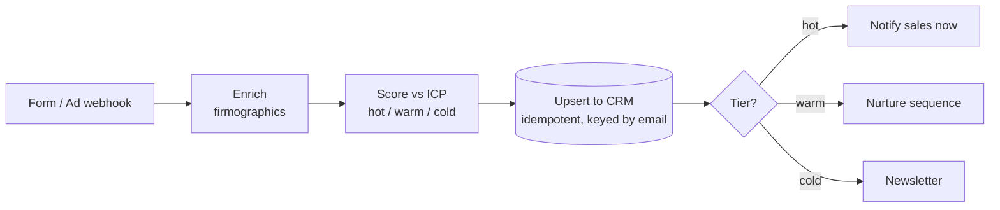

# 01 · Lead Capture → CRM

Turn raw inbound leads into scored, routed CRM records in seconds — no copy-paste, no missed
hot leads.

---

## The Problem

A lead fills out a form or clicks an ad. Someone has to: read it, look up the company, decide
if it's worth chasing, type it into the CRM, and kick off a follow-up. Multiply by every lead,
every day. It's slow, inconsistent, and hot leads go cold while sitting in an inbox.

## The Fix



Every inbound lead is enriched, scored against your Ideal Customer Profile, written to the CRM
**once** (re-runs never duplicate), and routed to the right follow-up automatically.

## Results

| Before | After |
|--------|-------|
| ~3–5 min of manual handling per lead | < 1 second, hands-off |
| Inconsistent, gut-feel qualification | Deterministic, explainable ICP score |
| Hot leads wait in an inbox | Sales pinged instantly on hot leads |
| Duplicate CRM records from re-entry | Idempotent upsert, one record per lead |

**Designed to save ~10 hrs/week** for a team handling 100+ leads and to drop time-to-first-touch
on hot leads to near zero.

## Stack

- **n8n** — the visual workflow (`workflow.json`): Webhook → Code → IF → CRM → Slack
- **Python** — the engine in `src/`: enrichment, ICP scoring, idempotent CRM client
- **Shared layer** — `../shared/`: retry-with-backoff, structured JSON logging, idempotent store
- **Swap-ins** (see `.env.example`): Apollo/Clearbit enrichment, HubSpot/Pipedrive/GoHighLevel
  CRM, optional LLM scoring (`claude-opus-4-8`), Slack/email follow-up

## How to run it

```bash
pip install -r ../requirements.txt
python run.py        # processes data/sample_leads.json, prints a summary
pytest               # 16 tests: scoring, enrichment, retry, end-to-end idempotency
```

No API keys required — it runs on the included sample data and writes a simulated CRM to
`data/crm_store.json`. To import the visual workflow, run `docker compose up -d` in the repo
root and import `workflow.json` from the n8n UI.

## How it's built (the proof)

```
src/
├── models.py       Lead + ScoredLead data shapes
├── config.py       ICP definition + scoring weights (tune without touching logic)
├── enrichment.py   firmographics (demo: domain heuristics; prod: Apollo/Clearbit)
├── scoring.py      deterministic ICP score → tier → next action (LLM-swappable)
├── crm_client.py   idempotent upsert, retry-wrapped (demo: JSON; prod: real CRM API)
└── pipeline.py     orchestrates enrich → score → upsert → route, with structured logs
```

The pieces a no-code-only build skips — **retry/backoff, idempotency, structured logging, and
tests** — are exactly what's here, because that's what makes an automation survive production.
