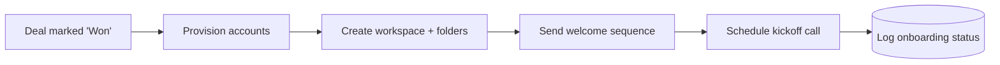

# 02 · Client Onboarding

> **Status: planned** — follows the identical template as [01 · Lead Capture → CRM](../01-lead-capture-to-crm/).

Automate everything that happens the moment a deal is signed: provision accounts, send the
welcome sequence, create the project workspace, and schedule kickoff — with zero manual setup.

## The Problem

Every new client triggers the same 15-step checklist done by hand: create logins, add to
billing, send welcome emails, set up a shared folder, book the kickoff call. It's tedious,
easy to half-finish, and the client's first impression is a slow, inconsistent start.

## The Fix (planned)



## Planned stack

- **n8n** workflow: CRM 'Won' trigger → provisioning → email sequence → calendar booking
- **Python** (`src/`): provisioning client, checklist state machine, idempotent status store
- Reuses `../shared/` for retry, structured logging, and idempotent writes

## Folder template (same as blueprint 01)

```
02-client-onboarding/
├── README.md          ← this file
├── workflow.json      ← n8n workflow
├── src/               ← provisioning + orchestration
├── tests/             ← pytest
├── data/              ← sample "won deal" payloads
└── .env.example       ← real integrations (CRM, email, calendar, provisioning)
```

_Build this next: `"build blueprint 02"`._
