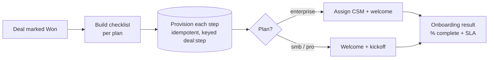

# 02 · Client Onboarding

A deal closes "Won" — and the whole post-sale checklist runs itself: account, workspace,
billing, welcome email, kickoff. No dropped steps, no double-charged customers.

---

## The Problem

A deal is marked Won and the clock starts. Someone has to provision the account, spin up a
workspace, add the customer to billing, send a welcome email, book the kickoff call — and for
big accounts, assign a CSM. Multiply by every new customer. It's manual, easy to half-finish,
and the failure modes are expensive: a customer billed twice, a welcome email sent three times,
or a kickoff that never gets scheduled while the deal goes cold before value is delivered.

## The Fix



Every won deal gets the right checklist for its plan, each step is provisioned **once**
(re-runs never re-provision), and you get an onboarding result with completed / skipped / failed
steps and a percent-complete — so nothing is silently half-done.

## Results

| Before | After |
|--------|-------|
| ~30–45 min of manual setup per new customer | < 1 second, hands-off |
| Steps skipped or done out of order, ad hoc | Deterministic, ordered checklist per plan |
| Re-running double-charges billing / re-sends emails | Idempotent per (deal, step) — re-runs are safe |
| No visibility into what's done vs pending | Explicit % complete, completed/skipped/failed, SLA |

**Designed to save ~8 hrs/week** for a team closing 20+ deals and to make every onboarding
auditable and SLA-tracked instead of living in someone's head.

## Stack

- **n8n** — the visual workflow (`workflow.json`): Deal Won → Code → SplitInBatches → IF → Slack/Email
- **Python** — the engine in `src/`: per-plan checklist, idempotent provisioning, onboarding result
- **Shared layer** — `../shared/`: retry-with-backoff, structured JSON logging, idempotent store
- **Swap-ins** (see `.env.example`): HubSpot/Pipedrive/Salesforce trigger, Auth0/WorkOS provisioning,
  Stripe billing, Postmark/SendGrid email, Calendly kickoff, optional LLM checklist tailoring
  (`claude-opus-4-8`)

## How to run it

```bash
pip install -r ../requirements.txt
python run.py        # processes data/sample_deals.json, prints a summary
pytest               # 15 tests: per-plan checklist, idempotency, percent-complete, end-to-end
```

No API keys required — it runs on the included sample data and writes a simulated provisioning
ledger to `data/onboarding_store.json`. To import the visual workflow, run `docker compose up -d`
in the repo root and import `workflow.json` from the n8n UI.

## How it's built (the proof)

```
src/
├── models.py              WonDeal + OnboardingResult data shapes
├── config.py              checklist steps + per-plan variation + SLA (tune without touching logic)
├── provisioning_client.py idempotent provision(step, deal_id), retry-wrapped (demo: JSON; prod: real APIs)
├── engine.py              required steps per plan -> execute idempotently -> result (LLM-swappable)
└── pipeline.py            orchestrates checklist -> provision -> result, with structured logs
```

The pieces a no-code-only build skips — **retry/backoff, idempotency, structured logging, and
tests** — are exactly what's here, because that's what makes an automation survive production.
