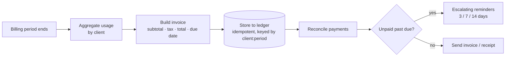

# 03 · Invoicing & Billing

Turn tracked usage into invoices, send them, chase late payments automatically, and reconcile
when money lands — so nothing slips and no one double-bills or chases by hand.

---

## The Problem

At the end of every billing cycle someone aggregates usage, builds invoices by hand, emails
them, watches for payment, and sends awkward reminder emails when clients run late. It's slow
and error-prone: revenue leaks through forgotten invoices and unchased overdue balances, and a
re-run of the billing job can double-bill a client.

## The Fix



Each period's usage is aggregated per client, turned into an invoice with deterministic money
math and a due date, written to the billing system **once** (re-runs never double-bill), then
reconciled against payments and chased with escalating reminders only when actually overdue.

## Results

| Before | After |
|--------|-------|
| ~20–30 min of manual invoice building per cycle | Seconds, hands-off |
| Inconsistent tax/total math, fat-finger errors | Deterministic money math, rounded to the cent |
| Forgotten overdue invoices go unchased | Escalating reminders fire automatically at 3 / 7 / 14 days |
| Re-running the billing job double-bills clients | Idempotent ledger, one invoice per client per period |

**Designed to save ~6 hrs/week** for a team billing dozens of clients each cycle and to stop
revenue leaking from unchased overdue balances.

## Stack

- **n8n** — the visual workflow (`workflow.json`): Schedule → Code → IF → Stripe/Email
- **Python** — the engine in `src/`: usage aggregation, invoice math, reminder scheduler,
  reconciliation, idempotent ledger
- **Shared layer** — `../shared/`: retry-with-backoff, structured JSON logging, idempotent store
- **Swap-ins** (see `.env.example`): Stripe/QuickBooks/Xero billing, Stripe-meter/BigQuery usage,
  Postmark/SendGrid/SES email, optional LLM-drafted dunning copy (`claude-opus-4-8`)

## How to run it

```bash
pip install -r ../requirements.txt
python run.py        # processes data/sample_usage.json (+ payments), prints a summary
pytest               # 29 tests: invoice math, due dates, reminders, idempotency, reconciliation
```

No API keys required — it runs on the included sample data and writes a simulated billing ledger
to `data/invoices_store.json`. All "today"/overdue logic takes an explicit `as_of` date, so runs
are fully deterministic. To import the visual workflow, run `docker compose up -d` in the repo
root and import `workflow.json` from the n8n UI.

## How it's built (the proof)

```
src/
├── models.py       UsageRecord + Invoice + Payment data shapes
├── config.py       BillingConfig: tax rate, terms, reminder cadence (tune without touching logic)
├── invoicing.py    build_invoice: subtotal/tax/total + due date, money rounded to the cent
├── reminders.py    due_reminders(invoice, as_of) -> which escalating offsets have fired
├── reconcile.py    apply_payment -> marks invoice paid / partial
├── ledger.py       idempotent upsert keyed by client:period, retry-wrapped (demo: JSON; prod: Stripe)
└── pipeline.py     orchestrates aggregate → build → store → reconcile → remind, with structured logs
```

The pieces a no-code-only build skips — **retry/backoff, idempotency, deterministic date logic,
structured logging, and tests** — are exactly what's here, because that's what makes an
automation survive production (and never double-bill a customer).
