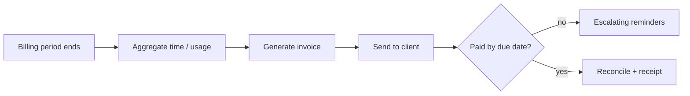

# 03 · Invoicing & Billing

> **Status: planned** — follows the identical template as [01 · Lead Capture → CRM](../01-lead-capture-to-crm/).

Turn tracked time/usage into invoices, send them, chase late payments automatically, and
reconcile when money lands — so nothing slips and no one chases by hand.

## The Problem

Someone builds invoices by hand each cycle, emails them, watches for payment, and sends awkward
reminder emails when clients are late. Revenue leaks through forgotten invoices and unchased
overdue balances.

## The Fix (planned)



## Planned stack

- **n8n** workflow: scheduled trigger → invoice build → send → reminder cadence → reconcile
- **Python** (`src/`): usage aggregation, invoice model, reminder scheduler, idempotent ledger
- Reuses `../shared/` for retry, structured logging, and idempotent writes

## Folder template (same as blueprint 01)

```
03-invoicing-billing/
├── README.md · workflow.json · src/ · tests/ · data/ · .env.example
```

_Build this next: `"build blueprint 03"`._
