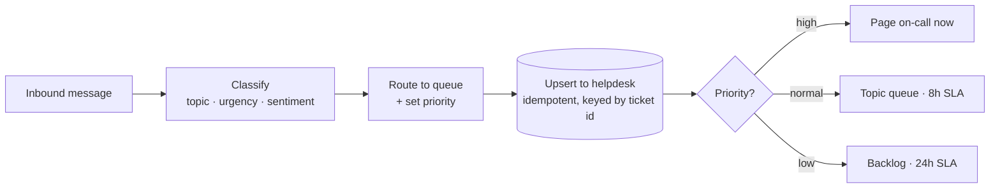

# 04 · Support Ticket Routing

Read every inbound support message, classify it, route it to the right queue, and raise an SLA
alert before anything goes stale — no manual triage, no urgent issue buried behind routine ones.

---

## The Problem

A support message lands. Someone has to: read it, guess the category, judge how urgent it is,
decide who should handle it, drop it in the right queue, and remember to chase it before the SLA
blows. Multiply by every ticket, every day. It's slow, inconsistent, and the outage email sits
behind ten "how do I export my data" questions.

## The Fix



Every inbound ticket is classified, routed to the right queue with the right priority, written
to the helpdesk **once** (re-runs never duplicate), given an SLA deadline, and flagged the moment
it's breaching — so nothing goes stale silently.

## Results

| Before | After |
|--------|-------|
| ~2–4 min of manual read-and-triage per ticket | < 1 second, hands-off |
| Inconsistent, gut-feel priority | Deterministic, explainable classification |
| Urgent outages buried behind routine tickets | High priority paged to on-call instantly |
| SLA breaches noticed only after a customer complains | Breaches flagged automatically |
| Duplicate tickets from re-processing the same message | Idempotent upsert, one record per ticket id |

**Designed to save ~12 hrs/week** for a team handling 150+ tickets and to drop time-to-route on
high-priority issues to near zero.

## Stack

- **n8n** — the visual workflow (`workflow.json`): Webhook → Code (classify) → Switch → action nodes
- **Python** — the engine in `src/`: rule-based classifier, routing rules, deterministic SLA tracker
- **Shared layer** — `../shared/`: retry-with-backoff, structured JSON logging, idempotent store
- **Swap-ins** (see `.env.example`): Zendesk/Freshdesk/Intercom helpdesk, Slack/PagerDuty paging,
  optional LLM classification (`claude-opus-4-8`)

## How to run it

```bash
pip install -r ../requirements.txt
python run.py        # processes data/sample_tickets.json, prints a summary
pytest               # 24 tests: classification, urgency, routing, SLA, breach, idempotency
```

No API keys required — it runs on the included sample data and writes a simulated helpdesk to
`data/tickets_store.json`. To import the visual workflow, run `docker compose up -d` in the repo
root and import `workflow.json` from the n8n UI.

## How it's built (the proof)

```
src/
├── models.py        Ticket + Classification + RoutedTicket data shapes
├── config.py        topic keywords, urgency signals, queue map, SLA windows (tune without touching logic)
├── classifier.py    deterministic topic/urgency/sentiment classify() (LLM-swappable: claude-opus-4-8)
├── routing.py       route() → queue/assignee/priority + sla_deadline() + is_breaching(as_of)
├── ticket_store.py  idempotent upsert keyed by ticket id, retry-wrapped (demo: JSON; prod: helpdesk API)
└── pipeline.py      orchestrates classify → route → upsert → flag breaches, with structured logs
```

The pieces a no-code-only build skips — **retry/backoff, idempotency, deterministic SLA timing,
structured logging, and tests** — are exactly what's here, because that's what makes an
automation survive production.
