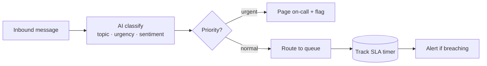

# 04 · Support Ticket Routing

> **Status: planned** — follows the identical template as [01 · Lead Capture → CRM](../01-lead-capture-to-crm/).

Read every inbound support message, classify it (topic, urgency, sentiment), route it to the
right person or queue, and raise an SLA alert before anything goes stale.

## The Problem

A human reads every incoming email/chat, guesses the category and priority, and forwards it to
whoever should handle it. Slow, inconsistent, and urgent issues get buried behind routine ones.

## The Fix (planned)



## Planned stack

- **n8n** workflow: inbox/webhook trigger → AI classifier node → routing → SLA watcher
- **Python** (`src/`): classifier (LLM, `claude-opus-4-8`), routing rules, SLA tracker
- Reuses `../shared/` for retry, structured logging, and idempotent writes

## Folder template (same as blueprint 01)

```
04-support-ticket-routing/
├── README.md · workflow.json · src/ · tests/ · data/ · .env.example
```

_Build this next: `"build blueprint 04"`._
