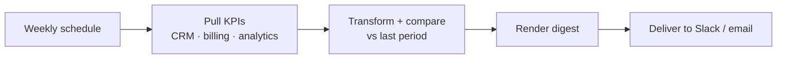

# 05 · Automated Reporting

> **Status: planned** — follows the identical template as [01 · Lead Capture → CRM](../01-lead-capture-to-crm/).

Pull KPIs from across the stack, transform them into a clean weekly digest, and deliver it to
Slack/email on a schedule — replacing the manual "build the weekly numbers" ritual.

## The Problem

Every week someone logs into 4–5 tools, copies numbers into a sheet or deck, writes a short
summary, and sends it around. Hours gone, and it's stale the moment it's built.

## The Fix (planned)



## Planned stack

- **n8n** workflow: cron trigger → multi-source fetch → transform → digest → deliver
- **Python** (`src/`): source connectors, metric transforms, digest renderer, optional LLM summary
- Reuses `../shared/` for retry, structured logging, and idempotent writes

## Folder template (same as blueprint 01)

```
05-automated-reporting/
├── README.md · workflow.json · src/ · tests/ · data/ · .env.example
```

_Build this next: `"build blueprint 05"`._
