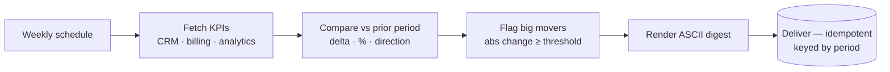

# 05 · Automated Reporting

Pull KPIs from every tool, compare this week to last, and deliver a clean digest to Slack/email
on a schedule — no more manual "build the weekly numbers" ritual.

---

## The Problem

Every week someone logs into 4–5 tools (CRM, billing, analytics), copies numbers into a sheet
or deck, eyeballs what moved, writes a short summary, and sends it around. It's an hour-plus of
copy-paste, it's error-prone, and the report is stale the moment it's built. The "what changed
vs last week" part — the only part anyone reads — is the bit most likely to be wrong.

## The Fix



Every period the pipeline fetches each source, compares current vs prior, flags the big movers,
renders a digest, and delivers it **once** (a cron retry never re-posts the same week's report).

## Results

| Before | After |
|--------|-------|
| ~1–2 hrs of copy-paste across 4–5 tools each week | Seconds, hands-off, on a schedule |
| "What moved?" computed by eye, often wrong | Deterministic delta / % / direction per metric |
| Big movers buried in a wall of numbers | Big movers flagged automatically by threshold |
| Cron retries spam the channel with duplicate digests | Idempotent delivery, one digest per period |

**Designed to save ~5 hrs/week** for a team running a weekly metrics review, and to make the
"what changed" section trustworthy instead of hand-computed.

## Stack

- **n8n** — the visual workflow (`workflow.json`): Schedule → fetch (CRM/billing/analytics) →
  Merge → Code (compare + render) → Slack + Email
- **Python** — the engine in `src/`: source connectors, metric comparison, digest renderer,
  idempotent delivery
- **Shared layer** — `../shared/`: retry-with-backoff, structured JSON logging, idempotent store
- **Swap-ins** (see `.env.example`): HubSpot/Salesforce CRM, Stripe/Chargebee billing,
  GA4/Plausible analytics, optional LLM narrative summary (`claude-opus-4-8`), Slack/email
  delivery

## How to run it

```bash
pip install -r ../requirements.txt
python run.py        # builds the report on data/sample_metrics.json, prints the digest + summary
pytest               # 24 tests: delta/pct math, highlight threshold, digest, idempotency, retry
```

No API keys required — it runs on the included sample data and writes a simulated delivery log to
`data/delivery_store.json`. Re-running the same period is a no-op (idempotent). To import the
visual workflow, run `docker compose up -d` in the repo root and import `workflow.json` from the
n8n UI.

## How it's built (the proof)

```
src/
├── models.py       MetricSnapshot + Report data shapes
├── config.py       sources, metric display names, highlight threshold, delivery channel
├── connectors.py   per-source fetch_metrics (demo: sample JSON; prod: CRM/billing/analytics APIs)
├── transform.py    compare current vs prior → delta, pct, direction, highlight (deterministic)
├── digest.py       render an ASCII markdown digest with big-mover markers
├── delivery.py     idempotent delivery keyed by period (demo: JSON; prod: Slack/email)
└── pipeline.py     orchestrates fetch → compare → render → deliver, with structured logs
```

The pieces a no-code-only build skips — **retry/backoff, idempotency (keyed by period),
structured logging, and tests** — are exactly what's here, because that's what makes an
automation survive production.
